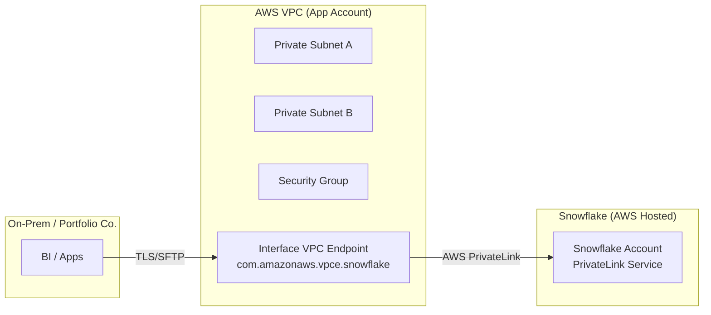

# AWS PrivateLink / VPC Architecture (Mermaid)

```mermaid
flowchart LR
  subgraph OnPrem["On-Prem / Portfolio Co."]
    BI[BI / Apps]
  end

  subgraph VPC["AWS VPC (App Account)"]
    SUB1[Private Subnet A]
    SUB2[Private Subnet B]
    SG[Security Group]
    EP[Interface VPC Endpoint<br/>com.amazonaws.vpce.snowflake]
  end

  subgraph Snowflake["Snowflake (AWS Hosted)"]
    SVC[Snowflake Account<br/>PrivateLink Service]
  end

  BI -->|TLS/SFTP| EP
  EP -->|AWS PrivateLink| SVC
```
